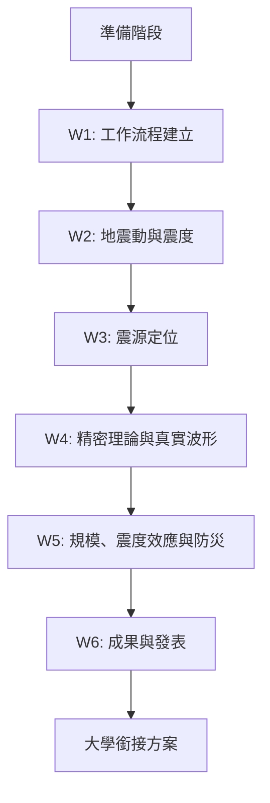

# 🌍 北市大暑假地球科學課程 - 學習指引

> **課程名稱**：北市大暑假地球科學課程計畫 - 地震學、地球物理與 AI/Agent 輔助教學實作
> **課程時間**：2026/7/17 起，共 6 週，每週四次，每次 4 小時
> **目標對象**：中小學教師
> **課程精神**：活動、動手做、啟發興趣

---

## 📚 學習路徑圖



---

## 🎯 學習目標

### 核心能力培養
- ✅ **地科基本概念**：建立中小學教師地震學與地球物理的基本理解
- ✅ **真實資料分析**：使用真實地震觀測資料進行簡單分析與教學設計
- ✅ **教學轉化能力**：將抽象的地震學概念轉化為中小學容易理解的活動
- ✅ **現代工具熟悉**：熟悉 GitHub、Vercel、HF、opencode、Hermes agent 等現代工具
- ✅ **教學自動化**：透過 Google GWS & GAS 建立教學自動化與成果展示流程
- ✅ **實作能力**：每週完成核心作業，實行野外/觀測活動，產出完整教案作品

---

## 📅 6 週學習計畫

### 📌 **第 1 週 (7/17) - 工作流程建立**
**主題**：課程介紹、名詞解釋、環境設定

#### 🎯 學習重點
- 熟悉雲端平台設定
- 自動化測試工具操作
- VS Code/Python/Git 環境配置
- IRIS 教學資源庫導引

#### 📋 學習任務
- [ ] 完成個人工作流程建立
- [ ] 熟悉 GitHub Repo 使用
- [ ] 完成 GAS 執行測試流程
- [ ] 設定 100-200 字個人教學目標

#### 💡 學習資源
- GitHub 入門教學
- Google Apps Script 基礎
- VS Code 設定指南
- IRIS 教育資源介紹

#### ✅ 評量標準
- ✅ Google/GitHub/Vercel 完成 3 項
- ✅ GitHub 有 Repo 且有 README.md
- ✅ GAS 完成執行一段測試程式碼

---

### 📌 **第 2 週 (7/24) - 地震動與震度**
**主題**：地震基本原理、加速度與震度量測

#### 🎯 學習重點
- 地震動的基本概念
- 加速度與震度的量測原理
- 手持感測器、筆電或 USB 感測器操作

#### 📋 學習任務
- [ ] 手持/感測器震動原理圖與圖表製作
- [ ] 完成一份學生版活動教案
- [ ] 完成一份教師版教學指引
- [ ] 200 字心得：如何協助學生理解震度

#### 💡 學習資源
- IRIS ground-shaking 活動
- 手持感測器操作教學
- 震度量測原理說明

#### ✅ 評量標準
- ✅ 觀測震動圖：包含一份實測震動資料及圖表
- ✅ 學生版：至少設計 3 題引導提問
- ✅ 教師版：清晰說明「加速度」與「震度」的差異

---

### 📌 **第 3 週 (7/31) - 震源定位**
**主題**：P-S 到時差、旅行時間與定位

#### 🎯 學習重點
- P 波與 S 波的基本概念
- 到時差的計算原理
- 利用到時差推算震源位置
- 完成九宮格定位

#### 📋 學習任務
- [ ] 3 個測站的 P、S 波到時與到時差表
- [ ] 震源位置推算與九宮定位圖
- [ ] GitHub 程式碼或 Google 試算表連結
- [ ] 設計一個探究活動引導學生思考

#### 💡 學習資源
- IRIS 震源定位活動
- P 波與 S 波特性說明
- 到時差計算工具

#### ✅ 評量標準
- ✅ 到時標準：正確標示九個不同測站資料
- ✅ 定位圖示：繪製九個求交點的定位格
- ✅ 探究思考：引領學生理解「為何需要九個測站」

---

### 📌 **第 4 週 (8/7) - 精密理論與真實波形**
**主題**：教科書第 4 章精密理論

#### 🎯 學習重點
- 精密地震學理論
- 真實地震波形資料分析
- jAmaSeis 或波形工具使用
- 真實地震波形 Dataset 操作

#### 📋 學習任務
- [ ] 一段第 4 章核心概念中文導讀
- [ ] 標註 P/S 波和其他重要波形的真實波形圖
- [ ] 整理九個測站可教導中小學的概念
- [ ] 200 字反思：地球科學與物理科學的重疊概念

#### 💡 學習資源
- Introduction to Earthquake Seismology 第 4 章
- jAmaSeis 工具教學
- 真實地震波形資料庫

#### ✅ 評量標準
- ✅ 專業導讀：用語精準，能提升使用 Python 進行旅行時間不確定性分析與定位精度分析
- ✅ 波形圖示：清晰標示波形特徵
- ✅ 分流設計：清晰指引大學與中學教學資源分流

---

### 📌 **第 5 週 (8/14) - 規模、震度效應與防災**
**主題**：規模與震度、建物與場址效應

#### 🎯 學習重點
- 地震規模與震度的區別
- 建物與場址效應的影響
- IRIS Magnitude and Intensity 模組
- Vercel 與 GAS 部署

#### 📋 學習任務
- [ ] 互動網頁 URL (Vercel 或 GitHub Pages)
- [ ] 自製「規模 vs 震度」視覺化比較圖
- [ ] 場址效應與建物震動觀測活動
- [ ] 200 字防災教學實體應用於場景說明

#### 💡 學習資源
- IRIS Magnitude and Intensity 教材
- Vercel 部署教學
- 建物震動觀測工具

#### ✅ 評量標準
- ✅ 網頁功能：可公開開放互動功能運作正常
- ✅ 概念澄清：清晰說明規模與震度的差異
- ✅ 場址解析：說明地質軟硬與震波放大效應

---

### 📌 **第 6 週 (8/21) - 成果與發表**
**主題**：野外/微震觀測、教案整合與發表

#### 🎯 學習重點
- 野外地震觀測實作
- 教案整合與完善
- 成果展示與分享

#### 📋 學習任務
- [ ] 完成教案設計 + 學生版教案 + 教師引導說明
- [ ] 線上作品連結整合
- [ ] 300 字暑假課程回饋
- [ ] 現場 5-7 分鐘口頭簡報或機器演示

#### 💡 學習資源
- 手持感測器或地震儀操作
- Teachable Moments 教材
- GitHub Pages 部署

#### ✅ 評量標準
- ✅ 概念融合：科學概念精準無誤且能銜接大學與中學教學
- ✅ 作業完成：數位教材可供九年級以上學生使用
- ✅ 口頭報告：能論述教案如何激發學生興趣

---

## ⏰ 每日標準流程 (4 小時)

| 時間 | 活動內容 | 重點目標 |
|------|----------|----------|
| 00-20 分鐘 | **本週介紹與時事分享** | 引入台東地震案例，說明本週核心目標 |
| 20-70 分鐘 | **地震學/地球物理核心理論講授** | 由淺入深解析物理模型與地球結構 |
| 70-120 分鐘 | **IRIS 實作教學與範例操作** | 動手操作 IRIS 的互動工具與真實資料 |
| 120-200 分鐘 | **數位工具與 AI Agent 實作開發** | 編寫至簡，設計網頁，利用 AI 輔助建立雲端展示頁面 |
| 200-240 分鐘 | **作業說明與小組作業互評** | 整理本週作業，說明下週研習任務與教學轉化思考 |

> ⚠️ **備註**：第 1 週因為環境設定與工具熟悉，流程按「介紹與時事、環境設定、工具測試、README」特殊排程，不執行 IRIS 活動。

---

## 🎓 大學銜接方案

### 銜接路徑

#### 1. **數據分析工程 (W1-W3)**
- **目標**：將中學定位活動，升級至使用 Python 進行旅行時間不確定性分析與定位精度分析
- **內容**：
  - Python 程式設計基礎
  - 旅行時間分析
  - 定位精度優化

#### 2. **地震工程與地球物理 (W2 & W5)**
- **目標**：由加速度量測延伸，延伸至 PGA、PGV 計算、場址效應放大與地球物理結構研究
- **內容**：
  - 加速度資料處理
  - PGA/PGV 計算方法
  - 場址效應分析
  - 地球內部結構研究

#### 3. **學術導讀與動態監測 (W4 & W6)**
- **目標**：深入六章地震波理論，並結合高密度地震儀陣列野外架設與微震監測、信號處理與統計分析
- **內容**：
  - 地震波理論深入探討
  - 高密度監測網路
  - 微震監測技術
  - 信號處理與分析

---

## 📊 評分標準

| 評分項目 | 權重 | 內容說明 |
|----------|------|----------|
| **每週可評分作業** | 60% | 每週完成核心作業，每週占 10% |
| **課堂互動與技術實作** | 20% | 積極參與課堂討論與技術操作 |
| **期末作業展示** | 20% | 完成教案作品與成果發表 |

### 核心精神
> **「這扇門的目標不是教地震學，而是讓中小學教師親手把地震學、地球物理、真實資料、AI agent、雲端平台與互動教學整合起來，做出能帶回學校，啟發學生興趣，並能延伸應用於教學現場的地球科學教學教案作品。」**

---

## 🛠 工具清單

### 必備工具
- **GitHub** - 程式碼版本控制與協作平台
- **Vercel** - 靜態網站部署平台
- **Hugging Face** - AI 模型與資料集平台
- **Google Apps Script (GAS)** - Google 服務自動化
- **opencode** - 程式碼協作工具
- **Hermes agent** - AI 助手工具

### 地震學工具
- **IRIS** - 地震學教育資源與工具
- **jAmaSeis** - 地震波形分析工具
- **手持感測器** - 地震動觀測
- **USB 感測器** - 地震資料收集

### 開發工具
- **VS Code** - 程式碼編輯器
- **Python** - 程式語言
- **Google Sheets** - 試算表工具
- **Google Drive** - 雲端儲存

---

## 📚 學習資源

### 官方資源
- [IRIS 教育資源](https://www.iris.edu/hq/inclass)
- [jAmaSeis 下載](https://www.alamoseismic.com/jAmaSeis/)
- [GitHub 官方教學](https://guides.github.com/)
- [Vercel 文件](https://vercel.com/docs)

### 書籍推薦
- **Introduction to Earthquake Seismology** - 精密地震學教科書
- **地震學導論** - 中文地震學入門書籍

### 線上課程
- GitHub 基礎課程
- Python 程式設計課程
- 地震學入門課程

---

## 💡 學習建議

### 1. **提前準備**
- 在課程開始前完成基本工具安裝
- 熟悉 GitHub 基本操作
- 了解 Google 服務的基本使用

### 2. **積極參與**
- 積極參與課堂討論
- 多提問，多實作
- 與其他學員分享經驗

### 3. **持續練習**
- 每週完成作業
- 多操作 IRIS 工具
- 多嘗試不同的地震資料

### 4. **教學應用**
- 思考如何將所學應用於教學
- 設計適合學生的活動
- 製作教學輔助工具

---

## 📞 協助與支援

### 常見問題
- **工具安裝問題**：參考官方文件或尋求技術支援
- **程式碼問題**：在 GitHub 上提交 Issue 或參與討論
- **概念理解問題**：向講師提問或參考推薦資源

### 社群支援
- GitHub 討論區
- 線上論壇
- 社群媒體群組

---

## 🎉 完成課程後

### 你將獲得
- ✅ 6 週完整的地震學與地球物理知識
- ✅ 實際操作 IRIS 等專業工具的能力
- ✅ 使用現代數位工具的熟練度
- ✅ 設計地球科學教案的能力
- ✅ 一套完整的教學作品集

### 後續發展
- 可以銜接大學地球科學相關課程
- 可以參與地震觀測與研究項目
- 可以在學校推廣地球科學教育
- 可以繼續深入研究地震學

---

## 📝 個人學習計畫表

```markdown
# 我的學習計畫

## 第 1 週 (7/17)
- [ ] 完成環境設定
- [ ] 熟悉 GitHub 操作
- [ ] 完成 GAS 測試
- [ ] 設定個人目標

## 第 2 週 (7/24)
- [ ] 學習地震動概念
- [ ] 操作感測器
- [ ] 完成震動圖表
- [ ] 設計教案

## 第 3 週 (7/31)
- [ ] 學習震源定位
- [ ] 完成到時差表
- [ ] 繪製定位圖
- [ ] 設計探究活動

## 第 4 週 (8/7)
- [ ] 學習精密理論
- [ ] 分析真實波形
- [ ] 完成導讀
- [ ] 反思概念

## 第 5 週 (8/14)
- [ ] 學習規模與震度
- [ ] 完成互動網頁
- [ ] 設計比較圖
- [ ] 完成防災教學

## 第 6 週 (8/21)
- [ ] 完成教案整合
- [ ] 完成作品展示
- [ ] 完成口頭報告
- [ ] 提交課程回饋
```

---

## 🏆 成功祕訣

1. **保持好奇心** - 地球科學充滿奧秘，保持探索的熱情
2. **勤於動手** - 理論需要實踐，多操作多嘗試
3. **不怕犯錯** - 錯誤是學習的機會，勇於嘗試
4. **分享交流** - 與他人分享你的發現與心得
5. **持之以恆** - 6 週的課程需要持續的投入

---

**祝你學習愉快，成為優秀的地球科學教育工作者！** 🌟

---

*最後更新：2026/7/17*
*維護者：北市大暑假地球科學課程團隊*
